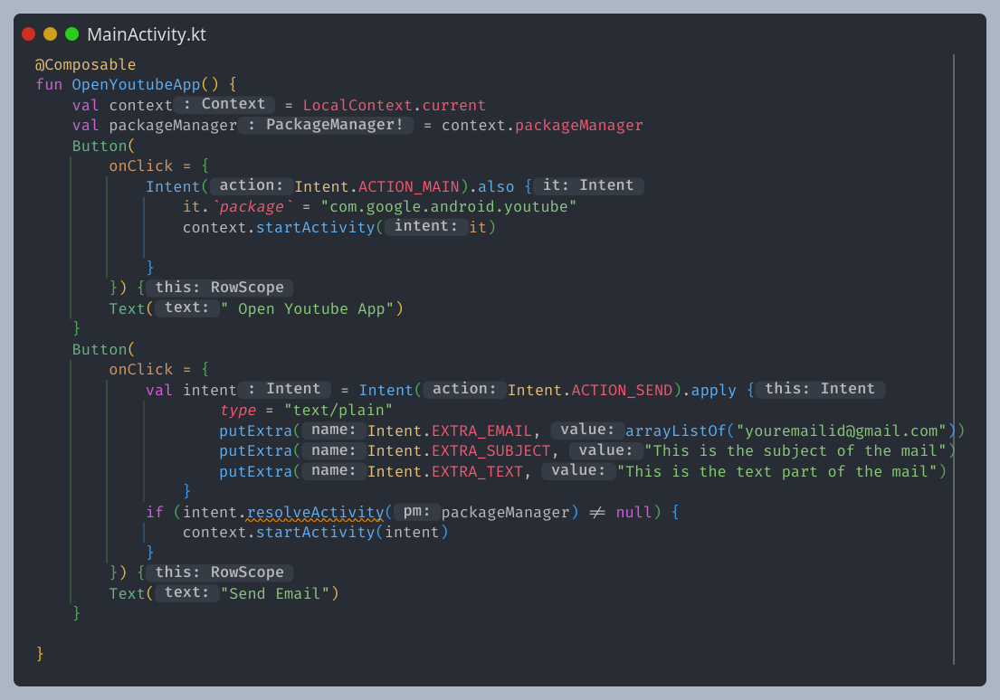

الـcontext أو السياق أو المٌحيط الذي يعمل فيه أو كلاس فيه المعلومات عن التطبيق
وبالتالي استخدامه للحصول علي الوصول إلي الريسورس الموجوده او ال بيوفرها الـAndroid
او أشغل Activity أو أبدأ Services
أنواع الـcontext
الـApplicationContext وهو singleton وبالتالي التطبيق له context واحد فقط ده هتتعامل معاه لما تشتغل
مع الـROOM
الـActivity/Service يرث من الـContextWrapper

الـBroadcast Receiver والـContent Provider
لا يملكون أي context بل يمرر لهم الـcontext

طب ازاي اعمل الـcontext في الـcompose عن طريق
val context = LocalContext.current

المصادر:
https://3alam.pro/alhazmy13/articles/android-context

الـIntents & Intent Filters
تستخدم للتواصل بين المكونات داخل وخارج التطبيق
1-يستخدم في الانتقال بين الواجهات Activities.
2-يستخدم أيضا لتشغيل الخدمات Services للقيام بإعمال في الخلفية.
3-يستخدم لاستقبال الاحداث Events ٍSystem من الـ Broadcast Receiver.
4-تحديد Launcher Activity أي تحديد الواجهة التي ستظهر ايقونتها بقائمة التطبيقات في الهاتف كمثال
عندما يكون في تطبيقك اربع واجهات فإن ال intent سيقوم بتحديد إي واجهة ستظهر أولا عند فتح التطبيق.
5-تمرير البيانات بين الواجهات ،والمكونات الاخرى للتطبيق.

عندي نوعين
الـimplicit بمعني ضمني انك تطلب اجراء معين بدون ما تحدد تطبيق زي تفتج لينك ف بتختار اي متصفح وهكذا
الـExplicit صريح زي انك تنتقل من activity لاخري او من سكرين لاخري وده بديله النافيجيشن

المصادر :
https://muteealjabri.blogspot.com/2016/06/what-is-the-intent.html

